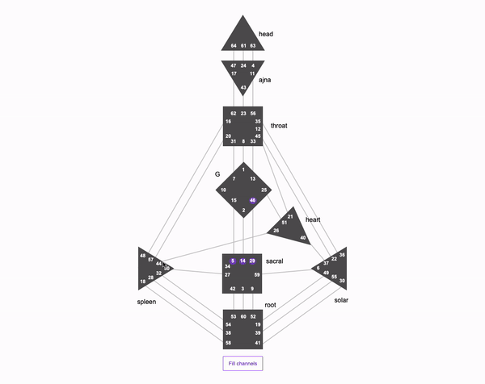

Привет 👋

# Bodygraph

[Просмотр приложения]()

Приложение - бодиграф с центрами, воротами, каналами и кнопкой, при нажатии на которую каналы закрашиваются в зависимости от выбранных активных ворот.

## Для локального запуска:

1. cd into the `bodygraph` folder
2. Run `npm install` at the root of your directory
3. Run `npm run dev` to start the project
4. Get bodygraph!

## Preview запуска

## Технологии

React, Redux-Toolkit
